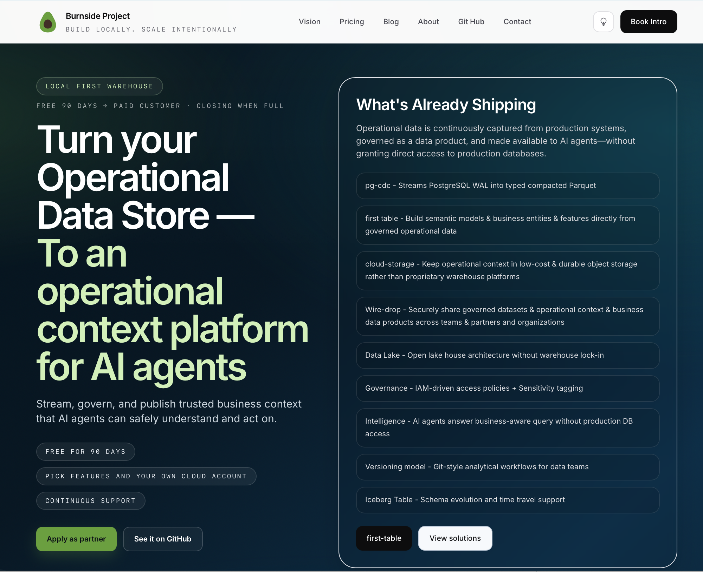

## Burnside Project

<p align="center">
  
</p>


Open infrastructure for governed analytics, PostgreSQL intelligence, and AI-ready data products.

We believe organizations should own their data, govern AI access, and build analytics without warehouse lock-in.

### Products

### pg-cdc

The security boundary between production PostgreSQL databases and AI agents.

Streams WAL changes into typed, compacted Parquet files in cloud storage. Creates a physical air gap — agents and developers query governed, immutable data without ever touching production. Pure Go. No CGO. Single binary.

#### Architecture

```
+-------------------------------+     +-------------------------------+
|       PRODUCTION ZONE         |     |     GOVERNED DATA ZONE        |
|                               |     |                               |
|  PostgreSQL                   |     |  S3 (immutable Parquet)       |
|  self-managed · RDS · Aurora  |     |  Glue Catalog + LF Tags       |
|         |                     |     |  DynamoDB ACL + Audit Trail   |
|         | WAL (one-way)       |     |         |             |       |
|         v                     |     |         |             |       |
|      pg-cdc ------------------|---->|   MCP Server     pg-warehouse |
|                               |     |   (AI agents)    (developers) |
+-------------------------------+     +-------------------------------+
```

- **No return path** — agents cannot write to production; the WAL is one-way, Parquet is immutable
- **No database credentials** — agents authenticate via IAM, not connection strings
- **Governed by default** — Lake Formation tags gate every read; untagged data is invisible
- **Time travel built in** — CDC epochs provide historical queries without database branching

### pg-warehouse

The data platform is built from 5 independent projects across 4 layers. Each layer has a clear responsibility and communicates via Iceberg tables in a shared Glue catalog.

#### Architecture
```
┌──────────────────────────────────────────────────────┐
│                    DATA PLATFORM                      │
│                                                      │
│  ┌─────────┐  ┌──────────────┐  ┌────────────────┐  │
│  │ pg-cdc  │  │ pg-warehouse │  │  wire-drop     │  │
│  │ (WAL→   │  │ (curate→     │  │  (receive→     │  │
│  │  Iceberg)│  │  publish→    │  │   Iceberg)     │  │
│  │         │  │  monitor)    │  │                │  │
│  └────┬────┘  └──────┬───────┘  └───────┬────────┘  │
│       │              │                   │           │
│       ▼              ▼                   ▼           │
│  ┌────────────────────────────────────────────┐      │
│  │         S3 + Iceberg + Glue               │      │
│  │  raw layer │ gold layer │ exchange layer   │      │
│  └────────────────────┬───────────────────────┘      │
│                       │                              │
│  ┌────────────────────▼───────────────────────┐      │
│  │         Governance (LF tags + ACL)          │      │
│  │  sensitivity tagging │ access policies      │      │
│  └────────────────────┬───────────────────────┘      │
│                       │                              │
│  ┌────────────────────▼───────────────────────┐      │
│  │         State + Intelligence               │      │
│  │  metrics │ anomalies │ AI agent            │      │
│  │  (data-agent repo)                         │      │
│  └────────────────────────────────────────────┘      │
│                                                      │
└──────────────────────────────────────────────────────┘
```

#### Layer 1: RAW (pg-cdc)

**Repo:** [burnside-project-pg-cdc](https://github.com/dataalgebra-engineering/burnside-project-pg-cdc)
**Status:** Production — Phases 1–6 complete, Iceberg shipping

Streams PostgreSQL WAL changes into Iceberg tables via the Glue catalog. Zero-gap replication using logical replication slots. Governed via Lake Formation tag-based access.

**Glue database:** `soak_test` (raw, ungoverned default: `sensitivity=confidential`)

#### Layer 2: CURATED (pg-warehouse)

**Repo:** [burnside-project-pg-warehouse](https://github.com/dataalgebra-engineering/burnside-project-pg-warehouse)
**Status:** Refresh working, publish planned

Pulls raw Iceberg → local DuckDB → transforms via SQL models → validates against contracts → publishes curated data products back to Iceberg in a gold database.

**Glue database:** `soak_test_gold` (curated, governed, contracted)

#### Continuous curation

pg-warehouse runs as a daemon (`pg-warehouse start`) that continuously:
1. Refreshes from raw Iceberg (incremental — only new snapshots)
2. Rebuilds affected models
3. Validates contracts
4. Publishes to gold Iceberg (append, not replace)
5. Computes state metrics

#### Layer 3: STATE (pg-warehouse)

**Lives in:** pg-warehouse (same binary, `monitor` command)
**Tables:** `_product_state`, `_observations`, `_annotations` in gold database

Three-tier state model:

| Tier | Who writes | What | Conflicts? |
|---|---|---|---|
| Authoritative | CI pipeline | Trailing metrics, z-scores, anomaly flags | No — latest CI run wins |
| Observations | Any analyst | Context, notes, evidence | No — append-only |
| Annotations | Authorized roles | Judgments (suppress alert, tag root cause) | No — append-only |

#### No state conflicts

Each analyst's observation is positional — timestamped and LSN-tagged. Like two photographers shooting the same street from different positions. Both are valid. The CI-computed value is authoritative. Analyst observations add context.

The contract defines what deviations require action (e.g., `z_score > 3`). The contract is the referee. CI is the scorekeeper. Analysts are the commentators.

#### wire-drop

Secure data exchange subscriber. Publishers push data over mTLS; wire-drop receives, deduplicates, writes Iceberg tables, and enforces tag-based governance.

#### Architecture

wire-drop uses hexagonal architecture (ports & adapters):

```
                          Publisher
                              │
                         mTLS push
                              │
                  ┌───────────▼───────────┐
                  │      Domain Core      │
                  │  Dedup, pipeline,     │
                  │  envelope handling    │
                  └───┬──┬──┬──┬──┬──┬───┘
                      │  │  │  │  │  │
          ┌───────────┘  │  │  │  │  └───────────┐
          ▼              ▼  │  ▼  │              ▼
    ┌──────────┐  ┌──────┐  │ ┌───────────┐  ┌──────────┐
    │ Receiver │  │ Sink │  │ │ Catalog   │  │Telemetry │
    │  (port)  │  │(port)│  │ │  (port)   │  │  (port)  │
    └────┬─────┘  └──┬───┘  │ └─────┬─────┘  └────┬─────┘
         │           │      │       │              │
         ▼           ▼      ▼       ▼              ▼
    ┌─────────┐ ┌────┬───┬──┐ ┌──────┐ ┌──────┐ ┌──────────┐
    │  mTLS   │ │FS  │S3 │GCS│ │SQLite│ │ Glue │ │Prometheus│
    │HTTP/TLS │ └────┘───┘──┘ └──────┘ └──────┘ │ + slog   │
    │  1.3    │       │           │        │     └──────────┘
    └─────────┘  ┌────▼────┐ ┌───▼───┐ ┌──▼──────────┐
                 │ Iceberg │ │ Dedup │ │ DynamoDB +   │
                 │ tables  │ │ state │ │Lake Formation│
                 └─────────┘ └───────┘ └──────────────┘
                                           Governance
                                            (port)
```

**Ports** (interfaces in `internal/port/`):
- **Receiver** — mTLS listener, accepts async data pushes from publishers
- **Sink** — durable storage for received data (filesystem, S3, GCS as Iceberg)
- **State** — track received files, deduplication via SHA-256 checksums
- **Catalog** — register Iceberg tables, schema evolution (Glue, Iceberg REST)
- **Governance** — tag-based access control (DynamoDB + Lake Formation)
- **Telemetry** — Prometheus metrics + structured JSON logging

**Adapters** (implementations in `internal/adapter/`):
- Receiver: mTLS HTTP server (TLS 1.3, client cert auth)
- Sink: filesystem, S3, GCS
- State: SQLite (WAL mode)
- Catalog: AWS Glue
- Governance: DynamoDB + Lake Formation
- Telemetry: Prometheus + slog JSON

#### ai-dial-pad

Publish governed data products as **dial-able tiny-URL MCP endpoints** — paste the URL into Claude or ChatGPT Enterprise and start a governed, audited conversation with your data.

> Like publishing a phone number for your data: you publish a "number" (a tiny URL); users **dial in** from their AI client and converse.
>
> `https://dial.burnside.ai/p/acme-orders` → pasted into a chatbox → connected → *"Is product X in stock?"* → answered from the governed lake.

## What it is

ai-dial-pad turns **governed data products on an AWS S3 lake** — Glue Data Catalog + Lake Formation tags + S3 Parquet, e.g. the data landed — into publishable, conversational MCP endpoints. It's **producer-agnostic**: the contract is the governed lake, not any one writer, so it works on any LF-governed, Glue-cataloged S3 data.

⸻
### pg-collector
pg-collector is a lightweight edge compute agent that extracts PostgreSQL telemetry, processes it locally through a DuckDB analytical warehouse, and delivers Parquet files to our cloud platform where AI analyzes patterns and predicts issues before they impact your users.

Single binary. Zero runtime dependencies. YAML config. Runs anywhere — systemd, Docker, Kubernetes, bare metal.

**Business Model:** Community Freeware. Demo tier is free for local testing; commercial tiers (Starter/Pro/Business/Enterprise) require a paid subscription via Key Service activation.

#### Architecture

```
PostgreSQL          Scheduler          Delta Calc         Ring Buffer
  │                    │                   │                  │
  │  pg_stat_* SQL     │                   │                  │
  │◄───────────────────│                   │                  │
  │  result rows       │                   │                  │
  │───────────────────►│  []Sample         │                  │
  │                    │──────────────────►│  rate calc        │
  │                    │                   │─────────────────►│
  │                    │                   │                  │
  ┌───────────────────────────────────────────────────────────┘
  │
  ▼
Ring Buffer ──Flush Loop (5s)──► SQLite WAL (durable)
                                       │
                                 Drain Loop (30s)
                                       │
                                       ▼
                                 DuckDB Warehouse (disposable)
                                       │
                              ┌────────┴─────────────────┐
                              │                          │
                        Rollup Engine              TTL Manager
                        (1m, 5m, 1h)               (prunes old)
                              │
                    ┌─────────┤
                    ▼         ▼
              Feature     Baseline
              Engine      Engine
              (26 health  (14-day
              indicators)  lookback)
                    │         │
                    └────┬────┘
                         ▼
                   Diagnostic Engine
                   (13 categories)
                         │
                         ▼
                   Parquet Export
                         │
                         ▼
                   Upload Outbox (exactly-once)
                         │
                         ▼
                   S3 via Presigned PUT
```


#### Why We Exist

Modern analytics stacks have become expensive, complex, and difficult to govern.

Organizations spend hundreds of thousands of dollars per year on data warehouses, ETL pipelines, governance tools, and AI integrations.

#### Burnside Project provides a simpler alternative:

* Open formats
* Local-first analytics
* Bring-your-own-cloud
* PostgreSQL-native
* AI-ready governance
* No vendor lock-in

⸻

#### Principles

Security by design
Governance first
Open standards
Local development experience
Cloud optional
AI enablement without production access

⸻

#### Community

Website: https://burnsideproject.ai
GitHub: https://github.com/burnside-project
Substack: https://burnsideproject.substack.com
LinkedIn: https://www.linkedin.com/company/burnside-project

⸻

#### Current Focus

Building the open infrastructure stack for governed AI and PostgreSQL intelligence.
